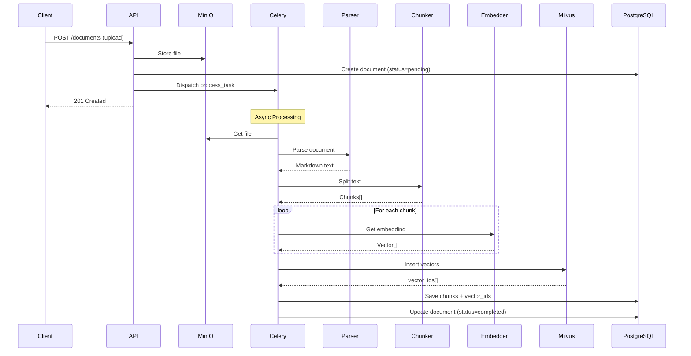
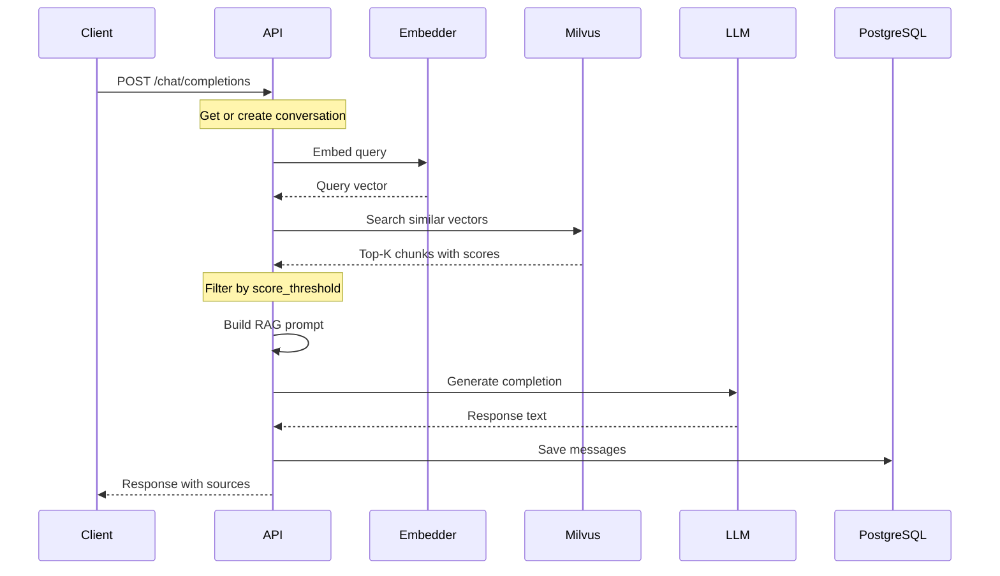

# KnowledgeBot MVP 技术设计方案

> 版本: v1.0  
> 日期: 2026-04-30  
> 状态: 设计中

---

## 一、MVP 目标与范围

### 1.1 核心目标

实现单服务架构的 RAG 核心 Pipeline：

```
文档上传 → 解析 → 分块 → 向量化 → Milvus存储 → 检索 → LLM生成回答
```

### 1.2 MVP 边界

| 功能 | MVP 状态 | 说明 |
|------|----------|------|
| 用户认证 | 简化 | 单租户，API Key 认证 |
| 知识库管理 | 实现 | CRUD 操作 |
| 文档管理 | 实现 | 上传、解析、分块、向量化 |
| 向量检索 | 实现 | 基于 Milvus 的相似度检索 |
| RAG 对话 | 实现 | 流式/非流式回答生成 |
| 多租户 | 延后 | 后续版本 |
| 权限管理 | 延后 | 后续版本 |
| 混合检索 | 延后 | 后续版本 |
| 评估系统 | 延后 | 后续版本 |

### 1.3 技术约束

- AI 模型通过 API 调用（非本地部署）
- 基础设施 Docker 化
- 单 FastAPI 服务，便于后续微服务拆分

---

## 二、技术选型

### 2.1 后端框架

| 组件 | 选型 | 版本 | 说明 |
|------|------|------|------|
| Web 框架 | FastAPI | 0.110+ | 异步支持、自动文档 |
| ASGI 服务器 | Uvicorn | 0.27+ | 生产级 ASGI |
| 任务队列 | Celery | 5.3+ | 异步文档处理 |
| 消息队列 | Redis | 7.2+ | Celery Broker（简化，替代 Kafka） |
| ORM | SQLAlchemy | 2.0+ | 异步支持 |
| 数据验证 | Pydantic | 2.5+ | 类型安全 |
| 配置管理 | Pydantic Settings | 2.1+ | 环境变量管理 |

### 2.2 AI/ML 组件

| 组件 | 选型 | 版本 | 说明 |
|------|------|------|------|
| Embedding API | SiliconFlow BGE-M3 | - | 推荐，成本低 |
| 备选 Embedding | OpenAI text-embedding-3-small | - | 备选方案 |
| LLM API | GLM-4 (智谱) | - | 推荐，中文效果好 |
| 备选 LLM | Qwen2.5-Turbo (阿里) | - | 备选方案 |
| LLM 框架 | LiteLLM | 1.20+ | 统一 LLM 接口 |
| 文档解析 | Unstructured | 0.12+ | 多格式支持 |
| 文本分块 | LangChain TextSplitters | 0.1+ | 递归分块 |

### 2.3 基础设施

| 组件 | 选型 | 版本 | 端口 | 说明 |
|------|------|------|------|------|
| 向量数据库 | Milvus Standalone | 2.3+ | 19530 | 向量存储与检索 |
| 关系数据库 | PostgreSQL | 15+ | 5432 | 元数据存储 |
| 缓存/Broker | Redis | 7.2+ | 6379 | Celery Broker + 缓存 |
| 文件存储 | MinIO | RELEASE.2024-01 | 9000/9001 | 文档文件存储 |
| 容器运行时 | Docker | 24.0+ | - | 容器化 |

### 2.4 开发工具

| 组件 | 选型 | 说明 |
|------|------|------|
| 包管理 | uv | 快速依赖管理 |
| 代码格式 | ruff | Linting + Formatting |
| 测试框架 | pytest | 单元测试 + 集成测试 |
| API 测试 | httpx | 异步 HTTP 客户端 |

---

## 三、PostgreSQL 数据表设计

### 3.1 ER 图

```
┌─────────────────┐       ┌─────────────────────┐
│  knowledge_bases │       │     documents       │
├─────────────────┤       ├─────────────────────┤
│ id (PK)         │───┐   │ id (PK)             │
│ name            │   │   │ kb_id (FK)          │
│ description     │   └──►│ file_name           │
│ embedding_model │       │ file_path           │
│ llm_model       │       │ file_size           │
│ status          │       │ file_type           │
│ created_at      │       │ status               │
│ updated_at      │       │ chunk_count          │
└─────────────────┘       │ error_message       │
                          │ created_at          │
                          │ updated_at          │
                          └─────────────────────┘
                                    │
                                    ▼
                          ┌─────────────────────┐
                          │      chunks         │
                          ├─────────────────────┤
                          │ id (PK)             │
                          │ doc_id (FK)         │
                          │ kb_id (FK)          │
                          │ content             │
                          │ content_hash        │
                          │ chunk_index         │
                          │ vector_id           │
                          │ token_count         │
                          │ metadata (JSONB)    │
                          │ created_at          │
                          └─────────────────────┘
                          
                          ┌─────────────────────┐
                          │   conversations     │
                          ├─────────────────────┤
                          │ id (PK)             │
                          │ kb_id (FK)          │
                          │ title               │
                          │ created_at          │
                          │ updated_at          │
                          └─────────────────────┘
                                    │
                                    ▼
                          ┌─────────────────────┐
                          │     messages        │
                          ├─────────────────────┤
                          │ id (PK)             │
                          │ conv_id (FK)        │
                          │ role (enum)         │
                          │ content             │
                          │ token_count         │
                          │ sources (JSONB)     │
                          │ created_at           │
                          └─────────────────────┘
```

### 3.2 表结构详情

#### 3.2.1 knowledge_bases 知识库表

```sql
CREATE TABLE knowledge_bases (
    id UUID PRIMARY KEY DEFAULT gen_random_uuid(),
    name VARCHAR(255) NOT NULL,
    description TEXT,
    embedding_model VARCHAR(100) DEFAULT 'bge-m3',
    llm_model VARCHAR(100) DEFAULT 'glm-4',
    embedding_dim INTEGER DEFAULT 1024,  -- BGE-M3 维度
    status VARCHAR(20) DEFAULT 'active',  -- active, archived
    created_at TIMESTAMP WITH TIME ZONE DEFAULT CURRENT_TIMESTAMP,
    updated_at TIMESTAMP WITH TIME ZONE DEFAULT CURRENT_TIMESTAMP
);

CREATE INDEX idx_kb_status ON knowledge_bases(status);
CREATE INDEX idx_kb_created ON knowledge_bases(created_at DESC);
```

#### 3.2.2 documents 文档表

```sql
CREATE TABLE documents (
    id UUID PRIMARY KEY DEFAULT gen_random_uuid(),
    kb_id UUID NOT NULL REFERENCES knowledge_bases(id) ON DELETE CASCADE,
    file_name VARCHAR(500) NOT NULL,
    file_path VARCHAR(1000),  -- MinIO path
    file_size BIGINT,
    file_type VARCHAR(50),    -- pdf, docx, md, txt
    file_hash VARCHAR(64),   -- SHA256
    status VARCHAR(20) DEFAULT 'pending',  -- pending, processing, completed, failed
    chunk_count INTEGER DEFAULT 0,
    error_message TEXT,
    created_at TIMESTAMP WITH TIME ZONE DEFAULT CURRENT_TIMESTAMP,
    updated_at TIMESTAMP WITH TIME ZONE DEFAULT CURRENT_TIMESTAMP
);

CREATE INDEX idx_doc_kb ON documents(kb_id);
CREATE INDEX idx_doc_status ON documents(status);
CREATE INDEX idx_doc_file_hash ON documents(file_hash);
```

#### 3.2.3 chunks 分块表

```sql
CREATE TABLE chunks (
    id UUID PRIMARY KEY DEFAULT gen_random_uuid(),
    doc_id UUID NOT NULL REFERENCES documents(id) ON DELETE CASCADE,
    kb_id UUID NOT NULL REFERENCES knowledge_bases(id) ON DELETE CASCADE,
    content TEXT NOT NULL,
    content_hash VARCHAR(64),  -- 内容哈希，用于去重
    chunk_index INTEGER NOT NULL,  -- 文档内的分块序号
    vector_id BIGINT,  -- Milvus 中的向量 ID
    token_count INTEGER,
    metadata JSONB DEFAULT '{}',  -- 页码、标题等元数据
    created_at TIMESTAMP WITH TIME ZONE DEFAULT CURRENT_TIMESTAMP
);

CREATE INDEX idx_chunk_doc ON chunks(doc_id);
CREATE INDEX idx_chunk_kb ON chunks(kb_id);
CREATE INDEX idx_chunk_vector ON chunks(vector_id);
CREATE INDEX idx_chunk_hash ON chunks(content_hash);
```

#### 3.2.4 conversations 对话表

```sql
CREATE TABLE conversations (
    id UUID PRIMARY KEY DEFAULT gen_random_uuid(),
    kb_id UUID REFERENCES knowledge_bases(id) ON DELETE SET NULL,
    title VARCHAR(500),
    created_at TIMESTAMP WITH TIME ZONE DEFAULT CURRENT_TIMESTAMP,
    updated_at TIMESTAMP WITH TIME ZONE DEFAULT CURRENT_TIMESTAMP
);

CREATE INDEX idx_conv_kb ON conversations(kb_id);
CREATE INDEX idx_conv_updated ON conversations(updated_at DESC);
```

#### 3.2.5 messages 消息表

```sql
CREATE TYPE message_role AS ENUM ('user', 'assistant', 'system');

CREATE TABLE messages (
    id UUID PRIMARY KEY DEFAULT gen_random_uuid(),
    conv_id UUID NOT NULL REFERENCES conversations(id) ON DELETE CASCADE,
    role message_role NOT NULL,
    content TEXT NOT NULL,
    token_count INTEGER,
    sources JSONB,  -- 引用的文档片段信息
    created_at TIMESTAMP WITH TIME ZONE DEFAULT CURRENT_TIMESTAMP
);

CREATE INDEX idx_msg_conv ON messages(conv_id);
CREATE INDEX idx_msg_created ON messages(created_at);
```

---

## 四、Milvus Collection 设计

### 4.1 Collection 结构

```python
from pymilvus import CollectionSchema, FieldSchema, DataType

# Collection 名称: {kb_id}_chunks
# 动态创建，每个知识库一个 Collection

fields = [
    FieldSchema(name="id", dtype=DataType.INT64, is_primary=True, auto_id=True),
    FieldSchema(name="chunk_id", dtype=DataType.VARCHAR, max_length=36),  # UUID
    FieldSchema(name="doc_id", dtype=DataType.VARCHAR, max_length=36),
    FieldSchema(name="kb_id", dtype=DataType.VARCHAR, max_length=36),
    FieldSchema(name="content", dtype=DataType.VARCHAR, max_length=8000),  # 分块内容
    FieldSchema(name="embedding", dtype=DataType.FLOAT_VECTOR, dim=1024),  # BGE-M3
    FieldSchema(name="metadata", dtype=DataType.JSON),  # 元数据
]

schema = CollectionSchema(
    fields=fields,
    description="Document chunks with embeddings",
    enable_dynamic_field=True
)
```

### 4.2 索引设计

```python
# 向量索引: IVF_FLAT (平衡检索速度和精度)
index_params = {
    "metric_type": "COSINE",  # 余弦相似度
    "index_type": "IVF_FLAT",
    "params": {"nlist": 1024}
}

# 创建索引
collection.create_index(field_name="embedding", index_params=index_params)

# 标量索引（用于过滤）
collection.create_index(field_name="doc_id")
collection.create_index(field_name="kb_id")
```

### 4.3 检索参数

```python
search_params = {
    "metric_type": "COSINE",
    "params": {"nprobe": 16}  # 搜索时检查的聚类数
}
```

### 4.4 Collection 命名规范

| Collection 名称 | 说明 |
|-----------------|------|
| `kb_{kb_id}` | 知识库对应的向量集合 |

---

## 五、REST API 接口设计

### 5.1 API 概览

| 模块 | 前缀 | 说明 |
|------|------|------|
| 知识库 | `/v1/knowledge-bases` | 知识库 CRUD |
| 文档 | `/v1/knowledge-bases/{kb_id}/documents` | 文档管理 |
| 对话 | `/v1/chat` | RAG 对话 |
| 检索 | `/v1/retrieval` | 向量检索 |
| 系统 | `/v1/system` | 系统状态 |

### 5.2 知识库 API

#### 5.2.1 创建知识库

```yaml
POST /v1/knowledge-bases
Content-Type: application/json

Request:
{
  "name": "产品文档库",
  "description": "产品相关文档",
  "embedding_model": "bge-m3",  # 可选，默认 bge-m3
  "llm_model": "glm-4"          # 可选，默认 glm-4
}

Response 201:
{
  "id": "550e8400-e29b-41d4-a716-446655440000",
  "name": "产品文档库",
  "description": "产品相关文档",
  "embedding_model": "bge-m3",
  "llm_model": "glm-4",
  "embedding_dim": 1024,
  "status": "active",
  "document_count": 0,
  "chunk_count": 0,
  "created_at": "2026-04-30T10:00:00Z",
  "updated_at": "2026-04-30T10:00:00Z"
}
```

#### 5.2.2 获取知识库列表

```yaml
GET /v1/knowledge-bases?page=1&page_size=20

Response 200:
{
  "data": [
    {
      "id": "...",
      "name": "产品文档库",
      "document_count": 10,
      "chunk_count": 150,
      ...
    }
  ],
  "pagination": {
    "page": 1,
    "page_size": 20,
    "total": 1,
    "total_pages": 1
  }
}
```

#### 5.2.3 获取知识库详情

```yaml
GET /v1/knowledge-bases/{kb_id}

Response 200:
{
  "id": "...",
  "name": "产品文档库",
  "description": "...",
  "embedding_model": "bge-m3",
  "llm_model": "glm-4",
  "status": "active",
  "document_count": 10,
  "chunk_count": 150,
  "created_at": "...",
  "updated_at": "..."
}
```

#### 5.2.4 更新知识库

```yaml
PUT /v1/knowledge-bases/{kb_id}

Request:
{
  "name": "新名称",
  "description": "新描述"
}

Response 200: { ... }
```

#### 5.2.5 删除知识库

```yaml
DELETE /v1/knowledge-bases/{kb_id}

Response 204: No Content
```

### 5.3 文档 API

#### 5.3.1 上传文档

```yaml
POST /v1/knowledge-bases/{kb_id}/documents
Content-Type: multipart/form-data

Request:
file: <binary>
auto_process: true  # 可选，自动触发处理

Response 201:
{
  "id": "...",
  "file_name": "document.pdf",
  "file_type": "pdf",
  "file_size": 1024000,
  "status": "pending",
  "created_at": "..."
}
```

#### 5.3.2 获取文档列表

```yaml
GET /v1/knowledge-bases/{kb_id}/documents?page=1&page_size=20&status=completed

Response 200:
{
  "data": [
    {
      "id": "...",
      "file_name": "document.pdf",
      "status": "completed",
      "chunk_count": 15,
      ...
    }
  ],
  "pagination": { ... }
}
```

#### 5.3.3 获取文档详情

```yaml
GET /v1/documents/{doc_id}

Response 200:
{
  "id": "...",
  "kb_id": "...",
  "file_name": "document.pdf",
  "file_type": "pdf",
  "file_size": 1024000,
  "status": "completed",
  "chunk_count": 15,
  "error_message": null,
  "created_at": "...",
  "updated_at": "...",
  "chunks": [
    {
      "id": "...",
      "chunk_index": 0,
      "content_preview": "...",
      "token_count": 200
    }
  ]
}
```

#### 5.3.4 触发文档处理

```yaml
POST /v1/documents/{doc_id}/process

Response 202:
{
  "task_id": "...",
  "status": "processing",
  "message": "Document processing started"
}
```

#### 5.3.5 删除文档

```yaml
DELETE /v1/documents/{doc_id}

Response 204: No Content
```

### 5.4 对话 API

#### 5.4.1 创建对话补全（非流式）

```yaml
POST /v1/chat/completions
Content-Type: application/json

Request:
{
  "kb_id": "550e8400-e29b-41d4-a716-446655440000",
  "conversation_id": null,  # 可选，为空则创建新对话
  "messages": [
    {"role": "user", "content": "请介绍一下产品的主要功能"}
  ],
  "top_k": 5,             # 检索数量，默认 5
  "score_threshold": 0.5, # 相似度阈值，默认 0.5
  "temperature": 0.7,
  "max_tokens": 2000
}

Response 200:
{
  "id": "chatcmpl-xxx",
  "conversation_id": "conv-xxx",
  "kb_id": "...",
  "choices": [
    {
      "index": 0,
      "message": {
        "role": "assistant",
        "content": "根据文档，产品主要功能包括..."
      },
      "finish_reason": "stop"
    }
  ],
  "sources": [
    {
      "chunk_id": "...",
      "doc_id": "...",
      "doc_name": "产品手册.pdf",
      "content": "相关片段内容...",
      "score": 0.85,
      "metadata": {"page": 5}
    }
  ],
  "usage": {
    "prompt_tokens": 1500,
    "completion_tokens": 500,
    "total_tokens": 2000
  },
  "created_at": "2026-04-30T10:00:00Z"
}
```

#### 5.4.2 创建对话补全（流式）

```yaml
POST /v1/chat/completions/stream
Content-Type: application/json

Request: 同上

Response 200 (Server-Sent Events):
data: {"id":"chatcmpl-xxx","choices":[{"delta":{"content":"根据"},"index":0}]}
data: {"id":"chatcmpl-xxx","choices":[{"delta":{"content":"文档"},"index":0}]}
data: {"id":"chatcmpl-xxx","choices":[{"delta":{"content":"..."},"index":0}]}
data: {"id":"chatcmpl-xxx","choices":[{"finish_reason":"stop","index":0}]}
data: [DONE]
```

#### 5.4.3 获取对话列表

```yaml
GET /v1/chat/conversations?kb_id={kb_id}&page=1&page_size=20

Response 200:
{
  "data": [
    {
      "id": "conv-xxx",
      "kb_id": "...",
      "title": "产品功能咨询",
      "message_count": 4,
      "created_at": "...",
      "updated_at": "..."
    }
  ],
  "pagination": { ... }
}
```

#### 5.4.4 获取对话详情

```yaml
GET /v1/chat/conversations/{conv_id}

Response 200:
{
  "id": "conv-xxx",
  "kb_id": "...",
  "title": "产品功能咨询",
  "messages": [
    {"role": "user", "content": "...", "created_at": "..."},
    {"role": "assistant", "content": "...", "sources": [...], "created_at": "..."}
  ],
  "created_at": "...",
  "updated_at": "..."
}
```

#### 5.4.5 删除对话

```yaml
DELETE /v1/chat/conversations/{conv_id}

Response 204: No Content
```

### 5.5 检索 API

#### 5.5.1 向量检索

```yaml
POST /v1/retrieval/search

Request:
{
  "kb_id": "...",
  "query": "产品的主要功能有哪些",
  "top_k": 10,
  "score_threshold": 0.3,
  "filters": {              # 可选过滤条件
    "doc_ids": ["..."],     # 指定文档
    "file_types": ["pdf"]   # 指定文件类型
  }
}

Response 200:
{
  "query": "产品的主要功能有哪些",
  "results": [
    {
      "chunk_id": "...",
      "doc_id": "...",
      "doc_name": "产品手册.pdf",
      "content": "相关片段内容...",
      "score": 0.92,
      "metadata": {"page": 5, "title": "功能介绍"}
    }
  ],
  "total": 10
}
```

### 5.6 系统 API

#### 5.6.1 健康检查

```yaml
GET /health

Response 200:
{
  "status": "healthy",
  "services": {
    "database": "ok",
    "milvus": "ok",
    "redis": "ok",
    "minio": "ok"
  }
}
```

#### 5.6.2 获取系统信息

```yaml
GET /v1/system/info

Response 200:
{
  "version": "0.1.0",
  "embedding_models": ["bge-m3", "text-embedding-3-small"],
  "llm_models": ["glm-4", "qwen2.5-turbo"],
  "supported_file_types": ["pdf", "docx", "md", "txt", "html"]
}
```

---

## 六、核心流程设计

### 6.1 文档处理流程



### 6.2 RAG 对话流程



### 6.3 分块策略

```python
from langchain.text_splitter import RecursiveCharacterTextSplitter

# MVP 默认分块配置
CHUNK_CONFIG = {
    "chunk_size": 500,      # 字符数
    "chunk_overlap": 50,    # 重叠字符数
    "separators": ["\n\n", "\n", "。", "！", "？", "；", ".", "!", "?", ";", " ", ""]
}

def chunk_text(text: str, metadata: dict = None) -> list[dict]:
    """
    分块函数
    
    Args:
        text: 原始文本
        metadata: 元数据（页码、标题等）
    
    Returns:
        分块列表
    """
    splitter = RecursiveCharacterTextSplitter(
        chunk_size=CHUNK_CONFIG["chunk_size"],
        chunk_overlap=CHUNK_CONFIG["chunk_overlap"],
        separators=CHUNK_CONFIG["separators"],
        length_function=len,
    )
    
    chunks = splitter.split_text(text)
    
    return [
        {
            "content": chunk,
            "chunk_index": i,
            "metadata": metadata or {}
        }
        for i, chunk in enumerate(chunks)
    ]
```

### 6.4 RAG Prompt 模板

```python
SYSTEM_PROMPT = """你是一个专业的知识库助手。基于提供的参考资料回答用户问题。

回答要求：
1. 仅使用参考资料中的信息回答
2. 如果参考资料没有相关信息，明确告知用户
3. 回答要准确、简洁、专业
4. 引用具体的来源"""

def build_rag_prompt(query: str, contexts: list[dict]) -> str:
    """
    构建 RAG 提示词
    """
    context_text = "\n\n---\n\n".join([
        f"【来源 {i+1}】{ctx['doc_name']} (页码: {ctx.get('page', 'N/A')})\n{ctx['content']}"
        for i, ctx in enumerate(contexts)
    ])
    
    return f"""参考资料：
{context_text}

用户问题：{query}

请基于参考资料回答用户问题："""
```

---

## 七、目录结构设计

```
knowledgebot/
├── services/
│   └── core/                           # MVP 单服务
│       ├── app/
│       │   ├── __init__.py
│       │   ├── main.py                 # FastAPI 入口
│       │   ├── config.py               # 配置管理
│       │   │
│       │   ├── api/
│       │   │   ├── __init__.py
│       │   │   ├── deps.py             # 依赖注入
│       │   │   ├── v1/
│       │   │   │   ├── __init__.py
│       │   │   │   ├── router.py       # 路由汇总
│       │   │   │   ├── knowledge_bases.py
│       │   │   │   ├── documents.py
│       │   │   │   ├── chat.py
│       │   │   │   ├── retrieval.py
│       │   │   │   └── system.py
│       │   │
│       │   ├── models/                 # SQLAlchemy 模型
│       │   │   ├── __init__.py
│       │   │   ├── base.py             # Base 模型
│       │   │   ├── knowledge_base.py
│       │   │   ├── document.py
│       │   │   ├── chunk.py
│       │   │   ├── conversation.py
│       │   │   └── message.py
│       │   │
│       │   ├── schemas/                # Pydantic 模型
│       │   │   ├── __init__.py
│       │   │   ├── knowledge_base.py
│       │   │   ├── document.py
│       │   │   ├── chunk.py
│       │   │   ├── chat.py
│       │   │   ├── retrieval.py
│       │   │   └── common.py
│       │   │
│       │   ├── services/               # 业务逻辑
│       │   │   ├── __init__.py
│       │   │   ├── kb_service.py
│       │   │   ├── document_service.py
│       │   │   ├── chat_service.py
│       │   │   ├── retrieval_service.py
│       │   │   └── embedding_service.py
│       │   │
│       │   ├── tasks/                  # Celery 任务
│       │   │   ├── __init__.py
│       │   │   ├── celery_app.py
│       │   │   ├── document_tasks.py
│       │   │   └── embedding_tasks.py
│       │   │
│       │   ├── processors/             # 文档处理
│       │   │   ├── __init__.py
│       │   │   ├── base.py
│       │   │   ├── pdf_processor.py
│       │   │   ├── docx_processor.py
│       │   │   ├── markdown_processor.py
│       │   │   └── text_processor.py
│       │   │
│       │   ├── retrievers/             # 检索器
│       │   │   ├── __init__.py
│       │   │   ├── base.py
│       │   │   └── milvus_retriever.py
│       │   │
│       │   ├── llm/                    # LLM 抽象
│       │   │   ├── __init__.py
│       │   │   ├── base.py
│       │   │   ├── factory.py
│       │   │   ├── zhipu.py            # 智谱 GLM
│       │   │   ├── qwen.py             # 阿里 Qwen
│       │   │   └── openai.py           # OpenAI
│       │   │
│       │   ├── embeddings/             # Embedding 抽象
│       │   │   ├── __init__.py
│       │   │   ├── base.py
│       │   │   ├── factory.py
│       │   │   ├── bge_m3.py           # BGE-M3 (SiliconFlow)
│       │   │   └── openai.py           # OpenAI
│       │   │
│       │   ├── storage/                # 存储抽象
│       │   │   ├── __init__.py
│       │   │   ├── minio_client.py
│       │   │   └── milvus_client.py
│       │   │
│       │   └── utils/
│       │       ├── __init__.py
│       │       ├── hash.py
│       │       ├── tokens.py
│       │       └── logging.py
│       │
│       ├── tests/
│       │   ├── __init__.py
│       │   ├── conftest.py
│       │   ├── test_api/
│       │   ├── test_services/
│       │   └── test_tasks/
│       │
│       ├── alembic/                    # 数据库迁移
│       │   ├── versions/
│       │   ├── env.py
│       │   └── alembic.ini
│       │
│       ├── Dockerfile
│       ├── pyproject.toml
│       ├── requirements.txt
│       └── .env.example
│
├── deploy/
│   ├── docker-compose.yml              # 开发环境
│   ├── docker-compose.prod.yml         # 生产环境
│   └── nginx/
│       └── nginx.conf
│
├── docs/                               # 已有文档目录
├── scripts/
│   ├── init_db.py                      # 初始化数据库
│   └── create_collection.py            # 创建 Milvus Collection
│
├── .hermes/
│   └── plans/
│       └── mvp-technical-design.md      # 本文档
│
├── .gitignore
├── Makefile
└── README.md
```

---

## 八、环境配置

### 8.1 环境变量

```bash
# .env.example

# 应用配置
APP_ENV=development
APP_DEBUG=true
APP_HOST=0.0.0.0
APP_PORT=8000
APP_SECRET_KEY=your-secret-key-here

# 数据库配置
POSTGRES_HOST=localhost
POSTGRES_PORT=5432
POSTGRES_USER=knowledgebot
POSTGRES_PASSWORD=your-postgres-password
POSTGRES_DB=knowledgebot

# Redis 配置
REDIS_HOST=localhost
REDIS_PORT=6379
REDIS_PASSWORD=

# Milvus 配置
MILVUS_HOST=localhost
MILVUS_PORT=19530

# MinIO 配置
MINIO_ENDPOINT=localhost:9000
MINIO_ACCESS_KEY=minioadmin
MINIO_SECRET_KEY=minioadmin
MINIO_BUCKET=knowledgebot
MINIO_SECURE=false

# Embedding API (SiliconFlow BGE-M3)
EMBEDDING_PROVIDER=siliconflow
SILICONFLOW_API_KEY=your-siliconflow-api-key
EMBEDDING_MODEL=BAAI/bge-m3
EMBEDDING_DIM=1024

# 备选 Embedding (OpenAI)
# EMBEDDING_PROVIDER=openai
# OPENAI_API_KEY=your-openai-api-key
# EMBEDDING_MODEL=text-embedding-3-small
# EMBEDDING_DIM=1536

# LLM API (智谱 GLM-4)
LLM_PROVIDER=zhipu
ZHIPU_API_KEY=your-zhipu-api-key
LLM_MODEL=glm-4

# 备选 LLM (阿里 Qwen)
# LLM_PROVIDER=qwen
# QWEN_API_KEY=your-qwen-api-key
# LLM_MODEL=qwen2.5-turbo

# 备选 LLM (OpenAI)
# LLM_PROVIDER=openai
# OPENAI_API_KEY=your-openai-api-key
# LLM_MODEL=gpt-4o-mini

# Celery 配置
CELERY_BROKER_URL=redis://localhost:6379/0
CELERY_RESULT_BACKEND=redis://localhost:6379/0

# 日志配置
LOG_LEVEL=INFO
LOG_FORMAT=json

# 分块配置
CHUNK_SIZE=500
CHUNK_OVERLAP=50

# 检索配置
DEFAULT_TOP_K=5
DEFAULT_SCORE_THRESHOLD=0.5
```

### 8.2 Docker Compose

```yaml
# deploy/docker-compose.yml
version: '3.8'

services:
  # 核心服务
  knowledgebot:
    build:
      context: ../services/core
      dockerfile: Dockerfile
    ports:
      - "8000:8000"
    environment:
      - APP_ENV=production
      - POSTGRES_HOST=postgres
      - REDIS_HOST=redis
      - MILVUS_HOST=milvus
      - MINIO_ENDPOINT=minio:9000
    env_file:
      - ../.env
    depends_on:
      - postgres
      - redis
      - milvus
      - minio
    volumes:
      - ../services/core/app:/app/app:ro
    networks:
      - knowledgebot-net

  # Celery Worker
  celery-worker:
    build:
      context: ../services/core
      dockerfile: Dockerfile
    command: celery -A app.tasks.celery_app worker --loglevel=info
    environment:
      - APP_ENV=production
      - POSTGRES_HOST=postgres
      - REDIS_HOST=redis
      - MILVUS_HOST=milvus
      - MINIO_ENDPOINT=minio:9000
    env_file:
      - ../.env
    depends_on:
      - postgres
      - redis
      - milvus
      - minio
    networks:
      - knowledgebot-net

  # PostgreSQL
  postgres:
    image: postgres:15-alpine
    ports:
      - "5432:5432"
    environment:
      POSTGRES_USER: knowledgebot
      POSTGRES_PASSWORD: ${POSTGRES_PASSWORD:-knowledgebot}
      POSTGRES_DB: knowledgebot
    volumes:
      - postgres-data:/var/lib/postgresql/data
    networks:
      - knowledgebot-net

  # Redis
  redis:
    image: redis:7-alpine
    ports:
      - "6379:6379"
    volumes:
      - redis-data:/data
    networks:
      - knowledgebot-net

  # Milvus Standalone
  milvus:
    image: milvusdb/milvus:v2.3.3
    ports:
      - "19530:19530"
      - "9091:9091"
    volumes:
      - milvus-data:/var/lib/milvus
    environment:
      ETCD_USE_EMBEDDED: "true"
    networks:
      - knowledgebot-net

  # MinIO
  minio:
    image: minio/minio:RELEASE.2024-01-16T16-07-38Z
    ports:
      - "9000:9000"
      - "9001:9001"
    environment:
      MINIO_ROOT_USER: ${MINIO_ACCESS_KEY:-minioadmin}
      MINIO_ROOT_PASSWORD: ${MINIO_SECRET_KEY:-minioadmin}
    volumes:
      - minio-data:/data
    command: server /data --console-address ":9001"
    networks:
      - knowledgebot-net

volumes:
  postgres-data:
  redis-data:
  milvus-data:
  minio-data:

networks:
  knowledgebot-net:
    driver: bridge
```

---

## 九、API 成本估算

### 9.1 Embedding 成本

| Provider | Model | 维度 | 价格 (每 1M tokens) |
|----------|-------|------|---------------------|
| SiliconFlow | BGE-M3 | 1024 | ¥0.5 (约 $0.07) |
| OpenAI | text-embedding-3-small | 1536 | $0.02 |
| OpenAI | text-embedding-3-large | 3072 | $0.13 |

### 9.2 LLM 成本

| Provider | Model | 价格 (输入/输出 每 1M tokens) |
|----------|-------|------------------------------|
| 智谱 | GLM-4 | ¥100 / ¥100 |
| 智谱 | GLM-4-Flash | 免费（限额） |
| 阿里 | Qwen2.5-Turbo | ¥0.3 / ¥0.6 |
| OpenAI | GPT-4o-mini | $0.15 / $0.60 |

### 9.3 MVP 预估

假设处理 1000 篇文档，每篇 10 页，平均 5000 字符：

- 文档总字符：5,000,000
- 分块数（500 字符/块）：约 10,000 块
- Embedding tokens：约 2,000,000 tokens
- Embedding 成本（BGE-M3）：约 ¥1

对话部分（100 用户/天，平均 10 轮对话）：
- 每月查询 tokens：约 30M
- LLM 成本（GLM-4）：约 ¥3,000/月
- LLM 成本（Qwen2.5-Turbo）：约 ¥18/月

---

## 十、性能指标

### 10.1 目标指标

| 指标 | 目标值 | 说明 |
|------|--------|------|
| 文档上传响应 | < 500ms | 不含处理时间 |
| 文档处理吞吐 | 10 docs/min | Celery Worker |
| 单次检索延迟 | < 100ms | Top-10 |
| 对话响应首字 | < 2s | 流式首 token |
| 并发对话 | 50 req/s | 单实例 |

### 10.2 资源需求

| 组件 | CPU | 内存 | 存储 |
|------|-----|------|------|
| API 服务 | 2核 | 4GB | - |
| Celery Worker | 2核 | 4GB | - |
| PostgreSQL | 2核 | 4GB | 20GB |
| Milvus | 4核 | 8GB | 100GB |
| Redis | 1核 | 2GB | 10GB |
| MinIO | 2核 | 4GB | 200GB |

---

## 十一、后续迭代路线

### Phase 2: 多租户与权限（v0.2）

- 租户隔离
- 用户认证（JWT）
- RBAC 权限模型
- API Key 管理

### Phase 3: 高级检索（v0.3）

- 混合检索（BM25 + 向量）
- 重排序（Reranker）
- 查询改写
- 元数据过滤

### Phase 4: 微服务拆分（v1.0）

- 拆分为独立微服务
- 服务间 gRPC 通信
- Kafka 替代 Redis
- Kubernetes 部署

---

## 附录：关键代码示例

### A. FastAPI 入口

```python
# services/core/app/main.py
from fastapi import FastAPI
from fastapi.middleware.cors import CORSMiddleware

from app.api.v1.router import api_router
from app.config import settings

app = FastAPI(
    title="KnowledgeBot",
    version="0.1.0",
    docs_url="/docs",
    redoc_url="/redoc",
)

app.add_middleware(
    CORSMiddleware,
    allow_origins=["*"],
    allow_credentials=True,
    allow_methods=["*"],
    allow_headers=["*"],
)

app.include_router(api_router, prefix="/v1")


@app.get("/health")
async def health_check():
    return {"status": "healthy"}
```

### B. Milvus 检索器

```python
# services/core/app/retrievers/milvus_retriever.py
from typing import list
from pymilvus import Collection, connections

class MilvusRetriever:
    def __init__(self, kb_id: str, embedding_dim: int = 1024):
        self.kb_id = kb_id
        self.collection_name = f"kb_{kb_id}"
        self.embedding_dim = embedding_dim
        self._collection = None
    
    def connect(self):
        connections.connect("default", host="localhost", port="19530")
        self._collection = Collection(self.collection_name)
        self._collection.load()
    
    def search(
        self,
        query_vector: list[float],
        top_k: int = 5,
        score_threshold: float = 0.5
    ) -> list[dict]:
        search_params = {"metric_type": "COSINE", "params": {"nprobe": 16}}
        
        results = self._collection.search(
            data=[query_vector],
            anns_field="embedding",
            param=search_params,
            limit=top_k,
            output_fields=["chunk_id", "doc_id", "content", "metadata"]
        )
        
        return [
            {
                "chunk_id": hit.entity.get("chunk_id"),
                "doc_id": hit.entity.get("doc_id"),
                "content": hit.entity.get("content"),
                "score": hit.distance,
                "metadata": hit.entity.get("metadata")
            }
            for hit in results[0]
            if hit.distance >= score_threshold
        ]
```

### C. Celery 任务

```python
# services/core/app/tasks/document_tasks.py
from app.tasks.celery_app import celery_app
from app.services.document_service import DocumentService
from app.processors import get_processor
from app.embeddings import get_embedder

@celery_app.task(bind=True)
def process_document(self, doc_id: str):
    """处理文档：解析 -> 分块 -> 向量化 -> 存储"""
    service = DocumentService()
    document = service.get_document(doc_id)
    
    try:
        # 更新状态
        service.update_status(doc_id, "processing")
        
        # 解析文档
        processor = get_processor(document.file_type)
        text, metadata = processor.process(document.file_path)
        
        # 分块
        chunks = chunk_text(text, metadata)
        
        # 向量化
        embedder = get_embedder()
        for chunk in chunks:
            chunk["embedding"] = embedder.embed(chunk["content"])
        
        # 存储
        service.save_chunks(doc_id, chunks)
        
        service.update_status(doc_id, "completed")
        
    except Exception as e:
        service.update_status(doc_id, "failed", str(e))
        raise
```

---

> 文档结束
