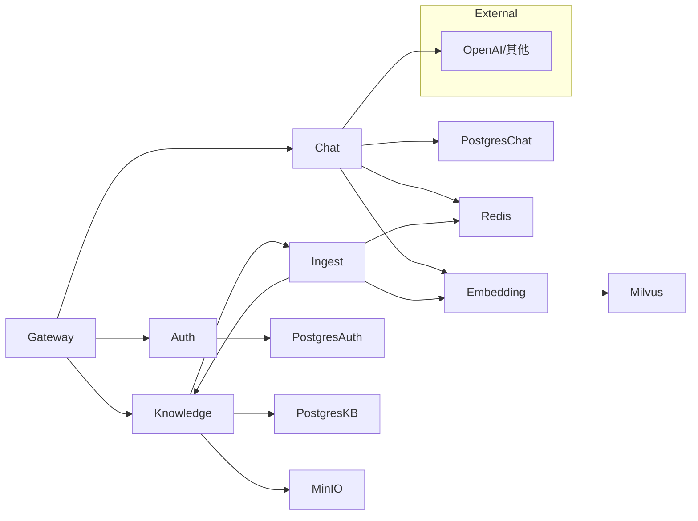

# 微服务拆分设计

## 服务划分

根据业务领域和扩展需求，将单体应用拆分为 **5 个微服务**：

```
┌─────────────────────────────────────────────────────────────────┐
│                        API Gateway                               │
│                    (Nginx / Kong)                                │
│              路由、限流、认证、日志                               │
└─────────────────────┬───────────────────────────────────────────┘
                      │
        ┌─────────────┼─────────────┬─────────────┬──────────────┐
        │             │             │             │              │
        ▼             ▼             ▼             ▼              ▼
┌───────────┐  ┌───────────┐  ┌───────────┐  ┌───────────┐  ┌───────────┐
│   Auth    │  │ Knowledge │  │ Embedding │  │   Chat    │  │  Ingest   │
│  Service  │  │  Service  │  │  Service  │  │  Service  │  │  Service  │
│           │  │           │  │           │  │           │  │           │
│ 认证授权  │  │ 知识库    │  │ 向量化    │  │ 对话检索  │  │ 文档处理  │
│ 用户管理  │  │ 文档管理  │  │ 服务      │  │ LLM调用  │  │ 异步任务  │
└─────┬─────┘  └─────┬─────┘  └─────┬─────┘  └─────┬─────┘  └─────┬─────┘
      │              │              │              │              │
      │              │              │              │              │
      ▼              ▼              ▼              ▼              ▼
┌─────────────────────────────────────────────────────────────────┐
│                     Infrastructure                               │
│                                                                  │
│  ┌──────────┐  ┌──────────┐  ┌──────────┐  ┌──────────┐        │
│  │PostgreSQL│  │  Milvus  │  │  MinIO   │  │  Redis   │        │
│  │   (DB)   │  │ (Vector) │  │ (Object) │  │(Cache+MQ)│        │
│  └──────────┘  └──────────┘  └──────────┘  └──────────┘        │
└─────────────────────────────────────────────────────────────────┘
```

## 服务详情

### 1. API Gateway (Nginx)

**职责**：
- 统一入口，路由分发
- SSL 终结
- 限流、熔断
- 请求日志
- 静态资源服务（前端）

**端口**：80/443

**配置**：`docker/nginx/nginx.conf`

---

### 2. Auth Service

**职责**：
- 用户注册/登录
- JWT Token 签发/验证
- 权限管理（RBAC）
- 多租户支持

**端口**：8001

**数据库**：
- `users` 表
- `tenants` 表
- `roles` 表
- `permissions` 表

**API**：
```
POST   /auth/register     # 注册
POST   /auth/login        # 登录
POST   /auth/refresh      # 刷新Token
POST   /auth/logout       # 登出
GET    /auth/me           # 当前用户信息
GET    /auth/tenants      # 用户的租户列表
```

---

### 3. Knowledge Service

**职责**：
- 知识库 CRUD
- 文档上传/下载/删除
- 文档元数据管理

**端口**：8002

**数据库**：
- `knowledge_bases` 表
- `documents` 表
- `chunks` 表

**对象存储**：MinIO (documents bucket)

**API**：
```
# 知识库
GET    /knowledge-bases           # 列表
POST   /knowledge-bases           # 创建
GET    /knowledge-bases/{id}      # 详情
PUT    /knowledge-bases/{id}      # 更新
DELETE /knowledge-bases/{id}      # 删除

# 文档
POST   /knowledge-bases/{id}/documents      # 上传
GET    /knowledge-bases/{id}/documents      # 列表
GET    /documents/{id}                      # 详情
DELETE /documents/{id}                      # 删除
GET    /documents/{id}/download             # 下载
GET    /documents/{id}/chunks               # 分块列表
```

---

### 4. Embedding Service

**职责**：
- 文本向量化
- 向量存储/删除
- 向量检索

**端口**：8003

**向量库**：Milvus

**API**：
```
POST   /embeddings/texts           # 批量向量化
POST   /embeddings/collections     # 创建集合
DELETE /embeddings/collections/{id} # 删除集合
POST   /embeddings/vectors         # 插入向量
DELETE /embeddings/vectors         # 删除向量
POST   /embeddings/search          # 向量检索
```

---

### 5. Chat Service

**职责**：
- 对话管理
- RAG 检索 + 生成
- 流式响应（WebSocket/SSE）
- 对话历史

**端口**：8004

**数据库**：
- `conversations` 表
- `messages` 表

**依赖服务**：
- Embedding Service（检索）
- LLM Provider（生成）

**API**：
```
# 对话
GET    /conversations              # 列表
POST   /conversations              # 创建
GET    /conversations/{id}         # 详情
DELETE /conversations/{id}         # 删除

# 消息
POST   /conversations/{id}/messages    # 发送消息
GET    /conversations/{id}/messages    # 消息列表
POST   /conversations/{id}/stream      # 流式对话 (SSE)
```

---

### 6. Ingest Service

**职责**：
- 异步文档处理
- 文档解析 + 分块
- 调用 Embedding Service 向量化

**端口**：8005（管理接口）

**消息队列**：Celery + Redis

**任务**：
```python
process_document_task(doc_id)      # 处理文档
retry_failed_task(doc_id)          # 重试失败任务
cleanup_orphaned_task(kb_id)       # 清理孤立数据
```

---

## 服务间通信

### 同步调用 (REST)

```
Chat Service → Embedding Service (检索)
Ingest Service → Embedding Service (向量化)
Ingest Service → Knowledge Service (更新状态)
```

使用 `httpx` 异步 HTTP 客户端：

```python
# services/chat/app/clients/embedding.py
class EmbeddingClient:
    async def search(self, kb_id: str, query: str, top_k: int):
        async with httpx.AsyncClient() as client:
            response = await client.post(
                f"{EMBEDDING_SERVICE_URL}/embeddings/search",
                json={"collection": kb_id, "query": query, "top_k": top_k}
            )
            return response.json()
```

### 异步调用 (Celery)

```
Knowledge Service → Redis Queue → Ingest Service (文档处理)
```

---

## 数据隔离

### PostgreSQL Schema

```
knowledgebot_auth        # Auth Service
knowledgebot_knowledge   # Knowledge Service
knowledgebot_chat        # Chat Service
```

### Milvus Collections

```
kb_{kb_id}   # 每个知识库一个 collection
```

### MinIO Buckets

```
documents-{tenant_id}   # 每个租户一个 bucket
```

---

## 配置管理

### 环境变量

每个服务有独立的 `.env`：

```bash
# services/auth/.env
DATABASE_URL=postgresql+asyncpg://...
JWT_SECRET_KEY=...
JWT_ALGORITHM=HS256
JWT_EXPIRE_MINUTES=1440

# services/knowledge/.env
DATABASE_URL=postgresql+asyncpg://...
MINIO_ENDPOINT=minio:9000
REDIS_URL=redis://redis:6379/0

# services/embedding/.env
MILVUS_HOST=milvus
MILVUS_PORT=19530
EMBEDDING_PROVIDER=openai
EMBEDDING_MODEL=text-embedding-3-small

# services/chat/.env
DATABASE_URL=postgresql+asyncpg://...
EMBEDDING_SERVICE_URL=http://embedding:8003
LLM_PROVIDER=openai
LLM_MODEL=gpt-4o-mini

# services/ingest/.env
REDIS_URL=redis://redis:6379/1
KNOWLEDGE_SERVICE_URL=http://knowledge:8002
EMBEDDING_SERVICE_URL=http://embedding:8003
```

---

## 目录结构

```
knowledgebot/
├── docker/
│   ├── nginx/
│   │   └── nginx.conf
│   └── docker-compose.yml
├── services/
│   ├── gateway/          # API Gateway
│   ├── auth/             # Auth Service
│   │   ├── app/
│   │   │   ├── api/
│   │   │   ├── models/
│   │   │   ├── schemas/
│   │   │   └── main.py
│   │   ├── tests/
│   │   ├── Dockerfile
│   │   └── requirements.txt
│   ├── knowledge/        # Knowledge Service
│   ├── embedding/        # Embedding Service
│   ├── chat/             # Chat Service
│   └── ingest/           # Ingest Service
├── libs/                 # 共享库
│   ├── common/          # 通用工具
│   │   ├── config.py
│   │   ├── logging.py
│   │   └── exceptions.py
│   └── proto/           # Protobuf 定义（可选）
├── scripts/              # 工具脚本
├── docs/                 # 文档
└── Makefile
```

---

## 迁移步骤

1. 创建各服务目录结构
2. 提取共享代码到 `libs/`
3. 拆分代码到各服务
4. 配置服务间通信
5. 更新 docker-compose
6. 更新测试

---

## 依赖关系图


