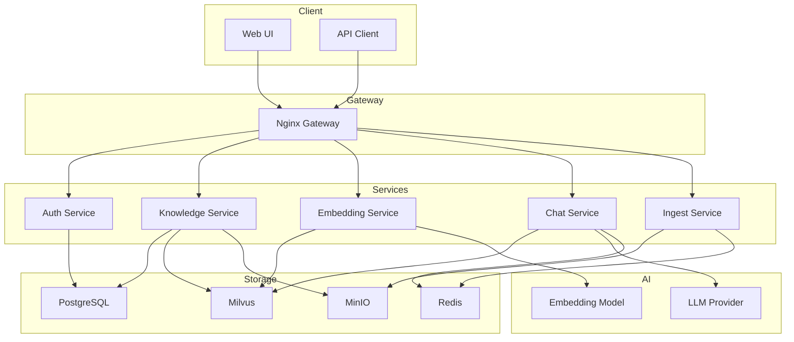
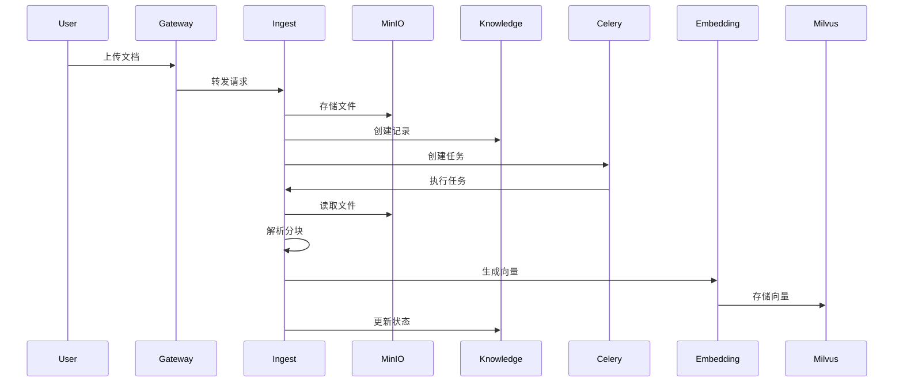
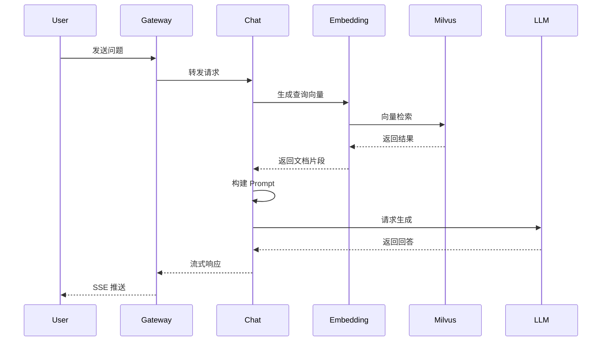

# 系统概述

KnowledgeBot 是一个企业级 RAG（检索增强生成）知识库系统。

## 设计目标

1. **高性能** - 毫秒级向量检索
2. **可扩展** - 微服务架构，独立扩展
3. **易部署** - Docker Compose 一键部署
4. **多模型** - 支持多种 LLM 和 Embedding 模型
5. **企业级** - 多租户、RBAC、监控告警

## 技术栈

### 后端
- Python 3.11+
- FastAPI
- Tortoise ORM
- Celery
- Pydantic

### 前端
- Vue 3
- TypeScript
- Element Plus
- Vite

### 数据存储
- PostgreSQL（关系数据）
- Milvus（向量检索）
- Redis（缓存/队列）
- MinIO（文件存储）

### AI/ML
- OpenAI / 通义千问 / 智谱 AI
- text-embedding-3-small
- LangChain

### 基础设施
- Docker / Docker Compose
- Kubernetes（可选）
- Nginx（API Gateway）
- Prometheus + Grafana（监控）

## 架构图

## 数据流向

### 文档处理流程

### 对话流程

## 核心功能

### 1. 知识库管理
- 创建/编辑/删除知识库
- 文档上传和管理
- 分块策略配置

### 2. 文档处理
- 多格式支持（PDF、Word、Markdown）
- 智能分块
- 异步处理队列

### 3. 向量检索
- Milvus 高性能检索
- 混合检索（向量 + BM25）
- 重排序优化

### 4. RAG 对话
- 多轮对话
- 流式响应
- 历史记录

### 5. 用户管理
- 注册/登录
- 多租户隔离
- RBAC 权限

### 6. 监控告警
- Prometheus 指标
- Grafana Dashboard
- 告警通知

## 扩展能力

### 模型扩展
- 新增 LLM 提供商
- 新增 Embedding 模型
- 自定义 Prompt

### 功能扩展
- 新增文档格式
- 自定义分块策略
- 插件系统

### 集成扩展
- Webhook 通知
- 第三方 API
- 自定义 Agent

## 下一步

- [微服务架构](microservices.md) - 各服务详细说明
- [数据流向](data-flow.md) - 数据处理流程