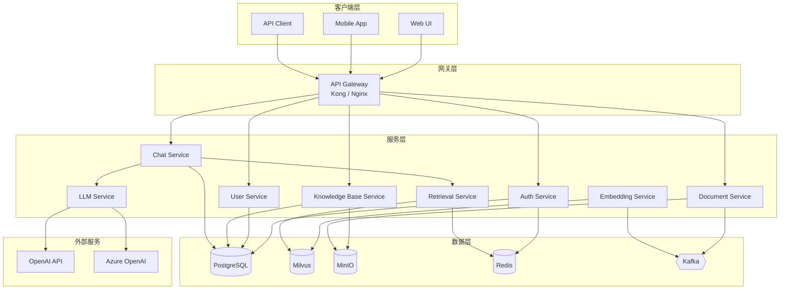
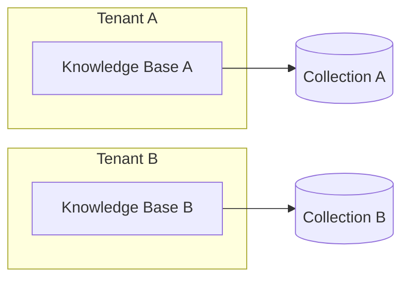
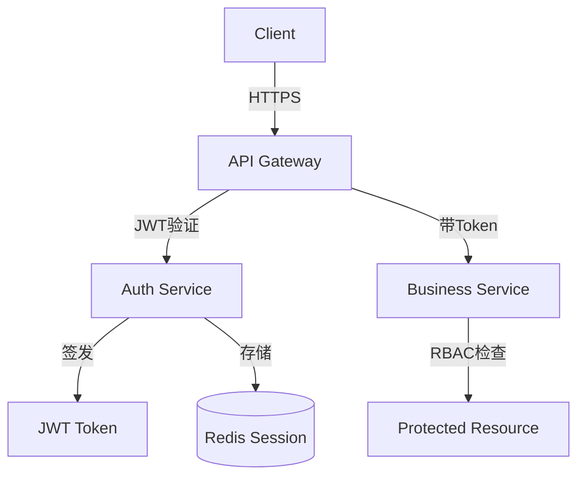

# 系统架构概览

## 整体架构

KnowledgeBot 采用微服务架构，由 9 个核心服务和 5 个基础设施组件构成。



## 技术栈

### 后端服务

| 组件 | 技术选型 | 版本 |
|------|----------|------|
| Web 框架 | FastAPI | 0.109+ |
| 异步框架 | asyncio | - |
| LLM 框架 | LangChain | 0.1+ |
| 嵌入模型 | BGE-M3 | - |
| ORM | SQLAlchemy | 2.0+ |
| 数据验证 | Pydantic | 2.0+ |

### 基础设施

| 组件 | 技术选型 | 用途 |
|------|----------|------|
| 向量数据库 | Milvus | 文档向量存储与检索 |
| 关系数据库 | PostgreSQL | 结构化数据存储 |
| 对象存储 | MinIO | 文档文件存储 |
| 缓存 | Redis | 会话缓存、查询缓存 |
| 消息队列 | Kafka | 异步任务处理 |

### DevOps

| 组件 | 技术选型 |
|------|----------|
| 容器化 | Docker |
| 编排 | Kubernetes / Docker Compose |
| 服务网格 | Istio (可选) |
| 监控 | Prometheus + Grafana |
| 日志 | ELK Stack |

## 核心设计原则

### 1. API 优先

所有服务通过 REST API 或 gRPC 通信，接口定义优先于实现。

### 2. 无状态服务

服务本身不保存状态，状态存储于 Redis/PostgreSQL，便于水平扩展。

### 3. 事件驱动

文档处理等长时任务通过 Kafka 解耦，实现异步处理。

### 4. 多租户架构

支持 SaaS 模式，租户数据隔离。



### 5. 可插拔 LLM

支持多种 LLM 后端，切换无感知。

```python
# 配置示例
LLM_PROVIDERS:
  openai:
    api_key: ${OPENAI_API_KEY}
    model: gpt-4
  azure:
    api_key: ${AZURE_OPENAI_KEY}
    endpoint: ${AZURE_ENDPOINT}
    model: gpt-35-turbo
```

## 服务通信

### 同步通信

```
Client → API Gateway → Service A → Service B (REST/gRPC)
```

### 异步通信

```
DocumentService → Kafka → EmbeddingService
                            ↓
                         Milvus
```

## 部署架构

### 开发环境 (Docker Compose)

```
docker-compose.yml
├── api-gateway (port 8000)
├── auth-service (port 8001)
├── chat-service (port 8002)
├── ...
├── postgres (port 5432)
├── milvus (port 19530)
├── redis (port 6379)
├── minio (port 9000)
└── kafka (port 9092)
```

### 生产环境 (Kubernetes)

```
Kubernetes Cluster
├── Namespace: knowledgebot
│   ├── Deployment: api-gateway (3 replicas)
│   ├── Deployment: auth-service (2 replicas)
│   ├── Deployment: chat-service (3 replicas)
│   ├── ...
│   ├── StatefulSet: postgresql
│   ├── StatefulSet: milvus
│   ├── Service: gateway-lb
│   ├── Ingress: knowledgebot-ingress
│   └── ConfigMap/Secret: app-config
└── Namespace: monitoring
    ├── Prometheus
    └── Grafana
```

## 安全架构



## 相关文档

- [微服务架构详解](microservices.md)
- [数据流向设计](data-flow.md)
- [架构决策记录](adr/index.md)