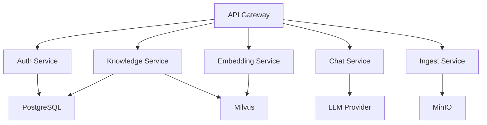

# KnowledgeBot

企业级 RAG（检索增强生成）知识库问答系统。

## 特性亮点

- **微服务架构** - 6 个独立服务，可独立扩展和部署
- **多模型支持** - OpenAI、通义千问、智谱 AI、SiliconFlow
- **高性能检索** - Milvus 向量数据库，毫秒级响应
- **多格式支持** - PDF、Word、Markdown、TXT、HTML
- **流式对话** - SSE 实时流式响应
- **多租户隔离** - RBAC 权限管理
- **生产就绪** - 完整监控告警、CI/CD、K8s 部署

## 快速开始

```bash
# 克隆项目
git clone https://github.com/NblScript/KnowledgeBot.git
cd KnowledgeBot

# 配置环境
cp .env.example .env
# 编辑 .env 填写 API Key

# 启动服务
make build && make up

# 访问
open http://localhost
```

## 架构概览



## 文档导航

- [安装指南](getting-started/installation.md) - 详细安装步骤
- [快速体验](getting-started/quickstart.md) - 5 分钟上手
- [API 参考](api/rest/reference.md) - RESTful API 文档
- [部署运维](deployment/docker-compose.md) - 生产环境部署

## 项目状态

| 组件 | 状态 | 说明 |
|------|------|------|
| Core Services | ✅ 完成 | Auth、Knowledge、Embedding、Chat、Ingest |
| Web UI | ✅ 完成 | Vue 3 + Element Plus |
| 监控告警 | ✅ 完成 | Prometheus + Grafana |
| CI/CD | ✅ 完成 | GitHub Actions |
| K8s 部署 | ✅ 完成 | 完整配置 + HPA |

## 贡献

欢迎贡献代码、报告问题或提出建议！

- [贡献指南](development/contributing.md)
- [GitHub Issues](https://github.com/NblScript/KnowledgeBot/issues)

## 许可证

[MIT License](https://github.com/NblScript/KnowledgeBot/blob/main/LICENSE)