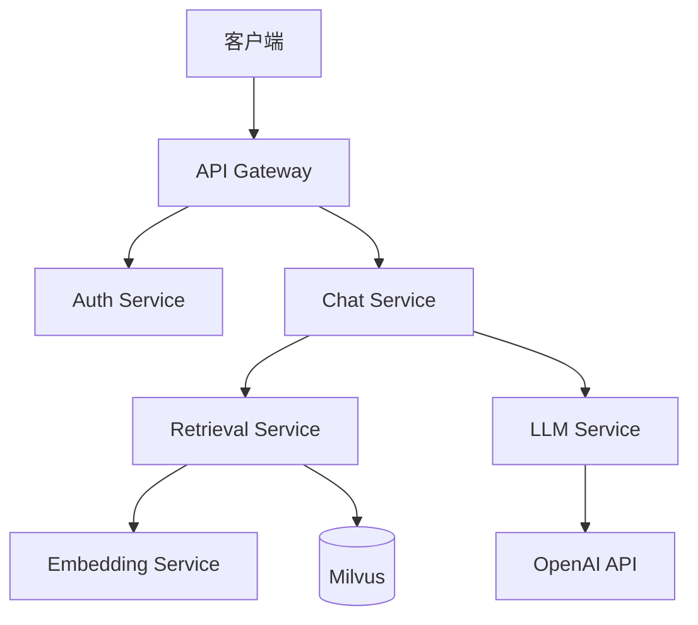

# Welcome to KnowledgeBot Documentation

!!! tip "企业级 RAG 知识库问答系统"
    KnowledgeBot 是一个高性能、可扩展的企业级 RAG（Retrieval-Augmented Generation）知识库问答系统，支持多租户、多知识库、多模型接入。

## 核心特性

- **多模型支持**: 支持 OpenAI、Azure OpenAI、本地模型等多种 LLM 后端
- **向量检索**: 基于 Milvus 的高性能向量检索
- **文档处理**: 自动解析 PDF、Word、Markdown 等多种格式
- **知识库管理**: 支持多知识库、多租户架构
- **对话流**: 流式输出、多轮对话、上下文管理
- **API 优先**: 完整的 REST API 和 WebSocket 支持

## 架构概览



## 快速开始

### 5 分钟体验

```bash
# 克隆项目
git clone https://github.com/org/knowledgebot.git
cd knowledgebot

# 配置环境变量
cp .env.example .env

# 启动服务
docker-compose up -d

# 访问服务
curl http://localhost:8000/health
```

### 下一步

<div class="grid cards" markdown>

-   :material-rocket-launch:{ .lg .middle } __快速开始__

    ---

    安装和配置 KnowledgeBot

    [:octicons-arrow-right-24: 安装指南](getting-started/installation.md)

-   :material-api:{ .lg .middle } __API 参考__

    ---

    完整的 API 文档

    [:octicons-arrow-right-24: API 文档](api/rest/reference.md)

-   :material-architecture:{ .lg .middle } __架构设计__

    ---

    了解系统架构设计

    [:octicons-arrow-right-24: 架构概览](architecture/overview.md)

-   :material-code-braces:{ .lg .middle } __开发指南__

    ---

    参与项目开发

    [:octicons-arrow-right-24: 贡献指南](development/contributing.md)

</div>

## 文档结构

| 章节 | 说明 |
|------|------|
| [快速开始](getting-started/index.md) | 安装、配置、快速体验 |
| [架构设计](architecture/overview.md) | 系统架构、微服务设计、架构决策 |
| [API 参考](api/rest/reference.md) | REST API、WebSocket 接口文档 |
| [服务文档](services/api-gateway/index.md) | 各微服务详细设计文档 |
| [开发指南](development/environment-setup.md) | 编码规范、测试指南、贡献流程 |
| [部署运维](deployment/docker-compose.md) | 部署方案、运维手册 |
| [测试](testing/strategy.md) | 测试策略、测试指南 |
| [参考资源](reference/glossary.md) | 术语表、FAQ、故障排查 |

## 版本信息

| 版本 | 状态 | 说明 |
|------|------|------|
| v1.0.0 | 开发中 | 初始版本，核心功能开发 |
| v0.1.0 | 规划中 | MVP 版本规划 |

## 社区与支持

- **GitHub**: [https://github.com/org/knowledgebot](https://github.com/org/knowledgebot)
- **问题反馈**: [GitHub Issues](https://github.com/org/knowledgebot/issues)
- **文档贡献**: 查看 [贡献指南](development/contributing.md)

---

*开始使用 KnowledgeBot，请前往 [快速开始](getting-started/index.md)。*